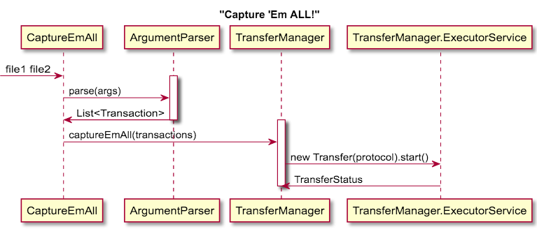

# Capture 'Em All!

Capture 'Em All is a file transfer writen in Java 8.
It is meant as a proof-of-concept of how a multithreaded file manager 
 can work on Java. Please feel free to pitch in new ideas and of course, new code.
 
Supported protocols:
 - http
 - https
 - ftp
 - sftp
 - file
 
## How to use it
Command line: `java -jar capture-em-all.jar file1 file2 -o=/downloads`

## What can be improved
 - CI/CD is not hooked, we should create new version after a merge to master
 - Tests - Exception scenarios not covered by automatic tests (manually tested):
    - File transfer interrupted
    - Really big files (once this is done, separate tests in fast, medium, slow suites)
 - PMD and Checkstyle plugins are not integrated to the build
 
# Backlog
 1. Graphical User Interface
 2. Scheduler - Schedule transfers to run on a cron based expression
 3. Progress meter for the CLI - It will be better to see the download progress rather than wonder if the application halted or is working quietly

# High level Sequence Diagram

